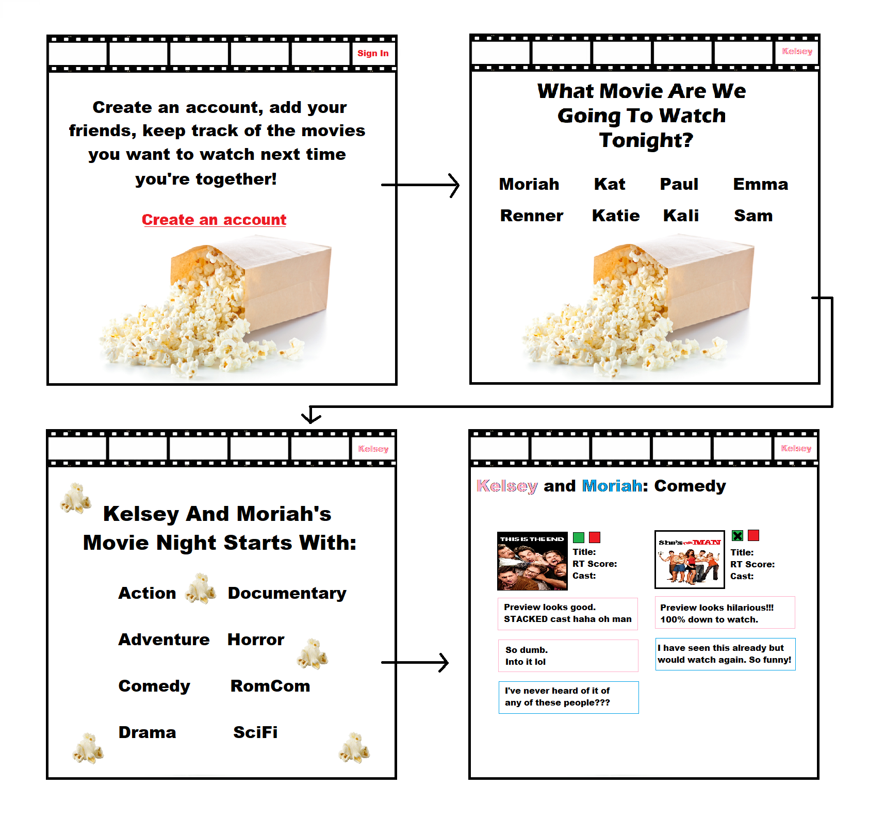
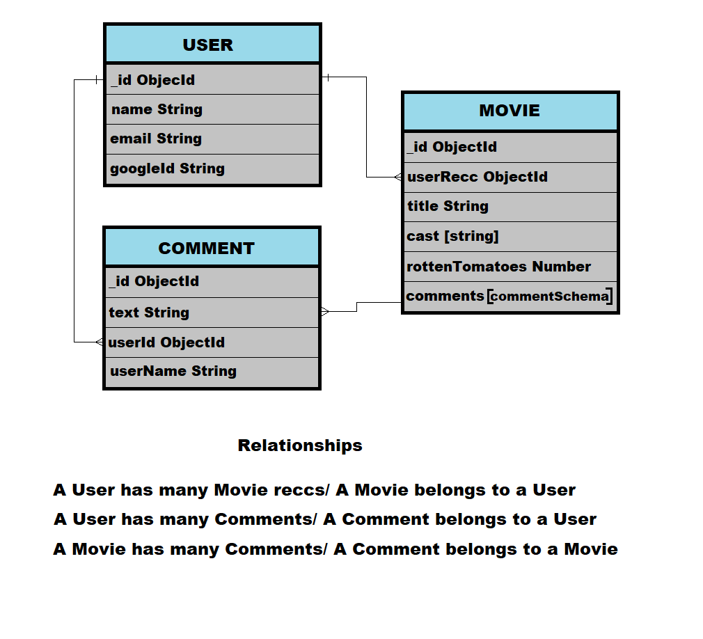

# [Movies With Friends](https://movies-and-friends.herokuapp.com/)
 

**Keep a running list of movies you want to watch with your friends next time you're together. Dont waste time scrolling through Netflix only to put on something you've seen already because you can't find anything new to watch!**
 
 
---
---
---
 
 

Initial wireframe of App

---
 

ERD

---

## Technologies Used:
- Bootstrap
- HTML
- CSS
- JavaScript
- MongoDB/Atlas/Mongoose
- Node.js
- Google Cloud Platform
- OUATH
- Heroku
- [Trello](https://trello.com/b/icsTZd5v/movie-app)
---

## Next Steps
1. Add a working comment section as well as a way to edit/delete comments
2. Fix bugs (delete movie, sign in and only see your own friends instead of everyones)
3. Add a working delete button to friends
4. Be able to log in to friends accounts and edit their entries
5. Make it look better

